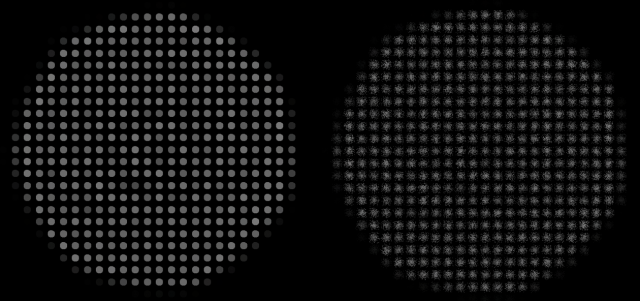

# Bokeh Fuse

> **Source:** *"\[DEV\] DCTL Convolve Bokeh Fuse"* [\#48](https://www.steakunderwater.com/wesuckless/viewtopic.php?p=37803#p37803) on WSL.

## Summary

- [Bokeh.fuse](Bokeh.fuse) source code

This is a simple convolutional filter, where you can achieve a bokeh from a self-drawn image.

See [DCTL Convolve Bokeh Fuse](https://www.steakunderwater.com/wesuckless/viewtopic.php?p=37803#p37803) thread on WSL for further information and full revision history.

See it in action:
- [TitleBurnEffect](../../Comp/tida/TitleBurnEffect.md) example Comp
- [Bokeh_Image](../../Macros/tida/Bokeh_Image.md) Macro
- [Bokeh_AChroma](../../Macros/tida/Bokeh_AChroma.md) Macro for Chromatic Aberration

## Description

> These are just some text fragments copied and pasted from the WSL discussion thread. This needs to be sorted out, complemented and reworded to make it a usable description for the current version.

Bokeh image is limited to 100x100 pixels. Image is multiplied and added to the Video in a typical convolutional way. But 50% grey is set to zero influence. Hence below 50% it will darken, above 50% it will brighten. But the Fuse is set on default to use normal B&W bokeh images.

- Amplify: does pronounce Bokeh at contrasty zones.
- Luma Balance: might be used if Luma does change too much compared to the original.
- Neutral Grey: raise it, if you like to build up a sharpen filter
- Anam Desqueeze: will change the bokeh aspect ratio. Multiply by 4/3 to calculate the aspect ratio of an anamorphic image. (1.8 * 4/3 = 2.40)
- CA: Chromatic Abberation (you can change strength and angle)

You are still able to add a depth map to Channel2 (purple input).

Make your bokeh image really small like 10x10 pixels. Increase Bokeh size by 10 or whatever. Even if you increase the Amplify slider you should not see any pattern formation.
The speed is not the best but for convolving it should be OK by now. It strongly depends on Bokeh input size but you can use now much smaller sizes to get similar results. In addition, if you set Amplify to zero you should see an increase in speed as mentioned power function is disabled.

Example - convolve for  100x100 pixel bokeh:
- Before: 100x100  (convolve) = 10.000 times to calculate full image in cycle --> very expensive
- Now: 10x 10 (convolve) + 10x3x2 (Gaussian with 3sigma) = 160 times to calculate full image in cycle --> much cheaper

To receive Bokeh without any pattern formation, you need to put the Size slider of this fuse to a whole number (not a fractional number). Did not make it as an integer as should be also used for smooth transitions.

Implemented Chromatic Aberration functionality. Furthermore, you have an additional option to switch to the Bokeh Image.

With a bokeh texture of 500x500 and a touch of Amplify, it will take some time to calculate only one frame. That's because 500x500x1024x1024 = 262.144.000.000 pixel (find/add/multiply etc.) calculations. And this is, why the size has been limited.

BokehFuse:

<a href="http://www.youtube.com/watch?feature=player_embedded&v=LOMFJisTwBY" target="_blank"> </a>

<!--
<iframe width="560" height="315" src="https://www.youtube.com/embed/LOMFJisTwBY" title="YouTube video player" frameborder="0" allow="accelerometer; autoplay; clipboard-write; encrypted-media; gyroscope; picture-in-picture" allowfullscreen></iframe>
-->

Bokeh and Depth:

<a href="http://www.youtube.com/watch?feature=player_embedded&v=WFAx9-qSc9U" target="_blank"> </a>

<!--
<iframe width="560" height="315" src="https://www.youtube.com/embed/WFAx9-qSc9U" title="YouTube video player" frameborder="0" allow="accelerometer; autoplay; clipboard-write; encrypted-media; gyroscope; picture-in-picture" allowfullscreen></iframe>
(Input: FastNoise, Text+, Ellipse)
-->

Bokeh and DepthToFocus Fuse:

<a href="http://www.youtube.com/watch?feature=player_embedded&v=FCHLosfC9Ds" target="_blank"> </a>

<!--
<iframe width="560" height="315" src="https://www.youtube.com/embed/FCHLosfC9Ds" title="YouTube video player" frameborder="0" allow="accelerometer; autoplay; clipboard-write; encrypted-media; gyroscope; picture-in-picture" allowfullscreen></iframe>
-->

Implemented micro-dithering to prevent some pattern formation when changing the size of bokeh. It will give an anti-aliasing effect while processing time is not influenced too much. Midgardsormr comments during his VariDilate Fuse development about solving rounding issues helped a lot.

Scaled Bokeh Image 100x100 pixel - left original - right convolve with micro dithering (without blur mix)

